# 🎯 Looker to BigQuery Real-Time Writeback Action Hub

이 디렉토리(`cloud_run_writeback/`)는 Looker 대시보드에서 **월별 매출 목표(`Monthly Sales Price Target`)를 실시간으로 수정하고 BigQuery에 즉시 적재(Writeback)**하기 위한 서버리스 백엔드(Google Cloud Functions Gen 2 / Cloud Run) 및 아키텍처 가이드입니다.

---

## 🗺️ 1. 전체 데이터 흐름 (Architecture Flow)

```mermaid
flowchart LR
    subgraph Looker["1. Looker UI & LookML"]
        A["📊 Dashboard Table Row<br/>(e.g., 2024-05)"] -->|"Click ⋮ -> Edit Target"| B["📝 Pre-filled Action Modal<br/>Month: 2024-05<br/>Current Target: $100,000"]
        B -->|"User enters $250,000<br/>& clicks Submit"| C["🚀 Webhook POST<br/>/action-0/execute"]
    end

    subgraph Serverless["2. Cloud Functions Gen 2 (Node.js)"]
        C -->|"cloudfunctions.net<br/>(Single Anycast IP)"| D["🔐 Auth & Payload Parser<br/>Extracts YYYY-MM & Amount"]
        D -->|"SQL DML Execution"| E["⚡ bigquery.query()<br/>INSERT INTO monthly_sales_targets"]
    end

    subgraph BigQuery["3. Google BigQuery"]
        E -->|"Appends new log row &<br/>invalidates BQ Cache"| F[("🗄️ Table: monthly_sales_targets<br/>(Append-Only Audit Log)")]
        F -->|"Window Function:<br/>ROW_NUMBER() OVER<br/>(PARTITION BY month<br/>ORDER BY updated_at DESC) = 1"| G["🔍 Derived Table View<br/>(Latest Target per Month)"]
    end

    G -->|"persist_for: 0 seconds<br/>(Zero Looker Cache)"| A
```



---

## 🛠️ 2. 구체적인 5단계 구축 방법 (Step-by-Step Blueprint)

### Step 1: BigQuery에 Append-Only 로그 테이블 생성 (`setup_bigquery.sql`)
기존 행을 직접 `UPDATE`하면 BigQuery 스트리밍 버퍼 락(최대 90분 수정 불가)에 걸릴 수 있습니다. 이를 원천 방지하고 수정 이력(Audit Trail)을 남기기 위해 **수정할 때마다 새 행(Row)을 아래로 쌓는 Append-Only 테이블**을 생성합니다.

```sql
CREATE SCHEMA IF NOT EXISTS `eco-shift-478607-e5.demo_dataset`;

CREATE TABLE IF NOT EXISTS `eco-shift-478607-e5.demo_dataset.monthly_sales_targets` (
  target_month STRING OPTIONS(description="Target Year-Month in YYYY-MM format"),
  target_amount FLOAT64 OPTIONS(description="Monthly Sales Price Target in USD"),
  updated_by STRING OPTIONS(description="Email of the user who updated the target"),
  updated_at TIMESTAMP OPTIONS(description="Timestamp of the target update"),
  note STRING OPTIONS(description="Reason or note for target adjustment")
);
```

---

### Step 2: Cloud Functions Gen 2 (Node.js) 웹훅 서버 배포 (`index.js` & `deploy.sh`)
Looker에서 전송한 JSON 페이로드를 받아 BigQuery에 적재하는 서버리스 API를 배포합니다.

* **핵심 포인트 1 (DNS 패킷 크기 이슈 해결)**: Cloud Run 기본 도메인(`*.a.run.app`)은 DNS 조회 시 IP 16개(IPv4 8개 + IPv6 8개, >512 bytes)를 반환하여 Public Looker 인스턴스의 Ruby 런타임에서 UDP DNS Truncation(`SocketError: name or service not known`) 에러를 유발합니다. 반드시 **단일 Anycast IP(`216.239.36.54`, <90 bytes)를 반환하는 `*.cloudfunctions.net` 도메인**을 사용하세요.
* **핵심 포인트 2 (BigQuery 캐시 즉시 무효화)**: 레거시 `table.insert()` 대신 **표준 SQL DML `INSERT INTO` (`bigquery.query`)**를 실행하여 데이터 적재와 동시에 BigQuery 내부 24시간 쿼리 캐시를 즉시 무효화합니다.

```bash
# Cloud Shell에서 배포 실행
cd ~/vibe-test/cloud_run_writeback
./deploy.sh
```

---

### Step 3: LookML Derived Table 뷰 생성 (`../views/monthly_sales_targets.view.lkml`)
BigQuery에 쌓인 여러 수정 이력 중 **월별로 가장 최신(`updated_at DESC`) 데이터 딱 1건(`rn = 1`)만** 조회하는 파생 테이블을 정의합니다.
* **핵심 포인트 (Symmetric Aggregates)**: 여러 달이 합산되는 상단 KPI 카드에서도 주문 건수(`order_items`)만큼 타겟 금액이 수천 배로 뻥튀기(Fanout)되지 않도록 **`type: sum_distinct`**와 **`sql_distinct_key: ${target_month} ;;`**를 설정합니다.

```lookml
view: monthly_sales_targets {
  derived_table: {
    sql:
      WITH ranked AS (
        SELECT *, ROW_NUMBER() OVER (PARTITION BY target_month ORDER BY updated_at DESC) AS rn
        FROM `eco-shift-478607-e5.demo_dataset.monthly_sales_targets`
      )
      SELECT target_month, target_amount, updated_by, updated_at, note
      FROM ranked WHERE rn = 1 ;;
  }

  dimension: target_month {
    primary_key: yes
    sql: ${TABLE}.target_month ;;
  }

  measure: monthly_sales_target {
    label: "Monthly Sales Price Target ($)"
    type: sum_distinct
    sql_distinct_key: ${target_month} ;;
    sql: ${TABLE}.target_amount ;;
    value_format_name: usd_0
  }
}
```

---

### Step 4: LookML Action 버튼 정의 (`../views/order_items.view.lkml`)
테이블에서 특정 월의 행을 클릭했을 때 **그 행의 연월(`{{ created_month._value }}`)과 현재 타겟 금액(`{{ monthly_sales_targets.monthly_sales_target._value }}`)이 모달창에 자동으로 채워지도록(Pre-fill)** `action:` 블록을 구성합니다.

```lookml
dimension: writeback_action {
  label: "🎯 Edit Monthly Sales Target"
  sql: CONCAT('🎯 Edit Target (', ${created_month}, ')') ;;
  action: {
    label: "🎯 Update Monthly Sales Target ($)"
    url: "https://us-central1-eco-shift-478607-e5.cloudfunctions.net/demo-bq-insert-action/action-0/execute"
    form_param: {
      name: "target_month"
      label: "Target Month (YYYY-MM)"
      default: "{{ created_month._value }}"
    }
    form_param: {
      name: "target_amount"
      label: "New Sales Price Target ($)"
      default: "{{ monthly_sales_targets.monthly_sales_target._value }}"
    }
  }
}
```

---

### Step 5: LookML Model 조인 및 캐시 완전 해제 (`../models/vibe_test.model.lkml`)
주문 테이블(`order_items.created_month`)과 타겟 뷰(`monthly_sales_targets.target_month`)를 조인하고, **Looker가 이전 쿼리 결과를 메모리에 캐싱하지 못하도록 `persist_for: "0 seconds"`를 선언**합니다.

```lookml
explore: Order_Analysis {
  view_name: order_items
  persist_for: "0 seconds"

  join: monthly_sales_targets {
    type: left_outer
    sql_on: ${order_items.created_month} = ${monthly_sales_targets.target_month} ;;
    relationship: many_to_one
  }
}
```

---

## 🔍 3. 트러블슈팅 & 핵심 해결책 요약 (6 Trials & Solutions)

| # | 겪었던 문제 (Symptom) | 근본 원인 (Root Cause) | 해결 방법 (Solution) |
| :--- | :--- | :--- | :--- |
| **1** | **웹훅 호출 시 `403 Forbidden` 에러** | GCP 조직 정책(`constraints/iam.allowedPolicyMemberDomains`)이 외부 공개(`allUsers`) 권한을 차단함. | 프로젝트 레벨에서 해당 Org Policy를 오버라이드하여 웹훅 진입을 허용하고, 인증은 Node.js 내부(`requireInstanceAuth`)에서 처리. |
| **2** | **`SocketError: initialize: name or service not known`** | `*.a.run.app` 도메인은 DNS 응답에 IP 16개(>512B)를 반환하여 Ruby 런타임에서 UDP Truncation 에러 발생. | 단일 Anycast IP(<90B)를 반환하는 **`*.cloudfunctions.net` 도메인**으로 엔드포인트 전환. |
| **3** | **BigQuery `UPDATE` 시 스트리밍 버퍼 락 에러** | BigQuery 스트리밍 버퍼에 적재된 행은 최대 90분간 `UPDATE`/`DELETE`가 잠김. | **Append-Only 로그 테이블** 설계 + `ROW_NUMBER() OVER (PARTITION BY month ORDER BY updated_at DESC) = 1` 윈도우 함수로 최신값 조회. |
| **4** | **연간 KPI 카드 합계 오류 및 Fanout 현상** | `type: max`는 연간 KPI에서 1달치만 표시되고, `type: sum`은 주문 건수만큼 타겟이 수천 배로 곱해짐. | LookML Symmetric Aggregates(`type: sum_distinct` + `sql_distinct_key: ${target_month}`) 적용. |
| **5** | **`HTTP 500: Input buffers must have same byte length`** | LookML `action:` 웹훅은 빈 `Authorization` 헤더(`length = 0`)를 보내 `crypto.timingSafeEqual`에서 예외 발생. | `timingSafeEqual` 호출 전 `if (aLen !== bLen) return false;` 체크 추가 및 Looker 웹훅 페이로드(`User-Agent: Looker...`) 허용. |
| **6** | **타겟 수정 후에도 차트가 갱신되지 않는 현상** | Looker 모델의 1시간 캐시(`max_cache_age: "1 hour"`) 및 BigQuery 스트리밍 적재 캐시 유지 현상. | LookML Explore에 `persist_for: "0 seconds"` 설정 + 백엔드를 표준 SQL DML `INSERT INTO` (`bigquery.query`)로 변경하여 캐시 즉시 무효화. |
